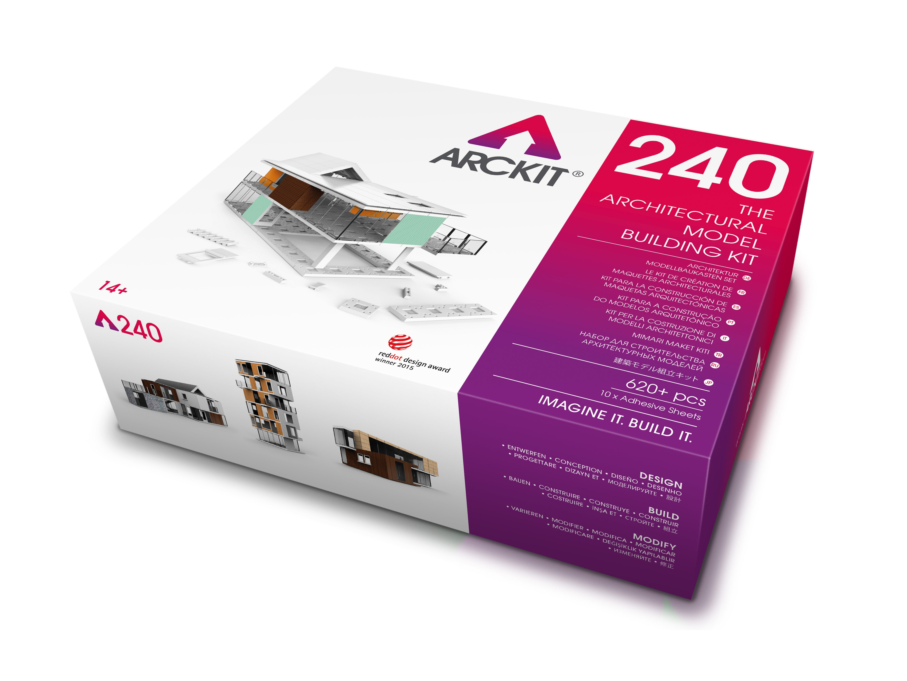

# a summary of Design Systems

From Designing Objects to Designing systems.
Systems that make better design results.
We make spaces.

**Architecture**

**ARCKIT**  | 2015

ARCKIT is a freeform architectural modelling system that allows you to physically explore designs and bring your ideas to life with speed and precision. Based on modern building techniques and a 1.2m/4ft grid to scale, the ‘click and connect’ modular components make it possible to create a vast range of structures that can be quickly assembled, endlessly modified and finished to perfection.

Created by Architect Damien Murtagh. "I developed Arckit as a professional tool for architects, however I always believed that by removing the difficulties associated with traditional model making – measuring, cutting, gluing and sticking – it had the potential to open up advanced model making to everyone" – [from dezeen](https://www.dezeen.com/2015/05/24/architect-modelling-system-arckit-posh-lego-damien-murtagh/)

**Lego Architecture Studio** | 2008

Lego set of 1210 monochromatic pieces comes with an inspiring guidebook of architectural legends and a short history on 'creative play' including Erector, Meccano and the Wright Blocks. "These toys were the building blocks of Modernism". It is no coincidence that Frank Lloyd Wright, Le Corbusier and Buckminster Fuller were all thaught in Kindergarten the school system that introduced building blocks  into eductation play. These simple forms reveal the first traces of modernism. – from the Architecture Studio book.

Modulor - Le Corbusier

Blocks -

USM Haller System

**Graphic Design**

Golden Ratio/Musical Scales - Page layouts (Robert Bringhurst)

Grid Systems - Muller Brockman

International Style

Type Scales

**Identity Systems**

Identity systems (Nasa, British Rail)

Design Idioms (London underground)

**User Interfaces**

Material Design - by Google

Human Interface Guidelines - Apple

Atomic Design / patternlab.io - Brad Frost
