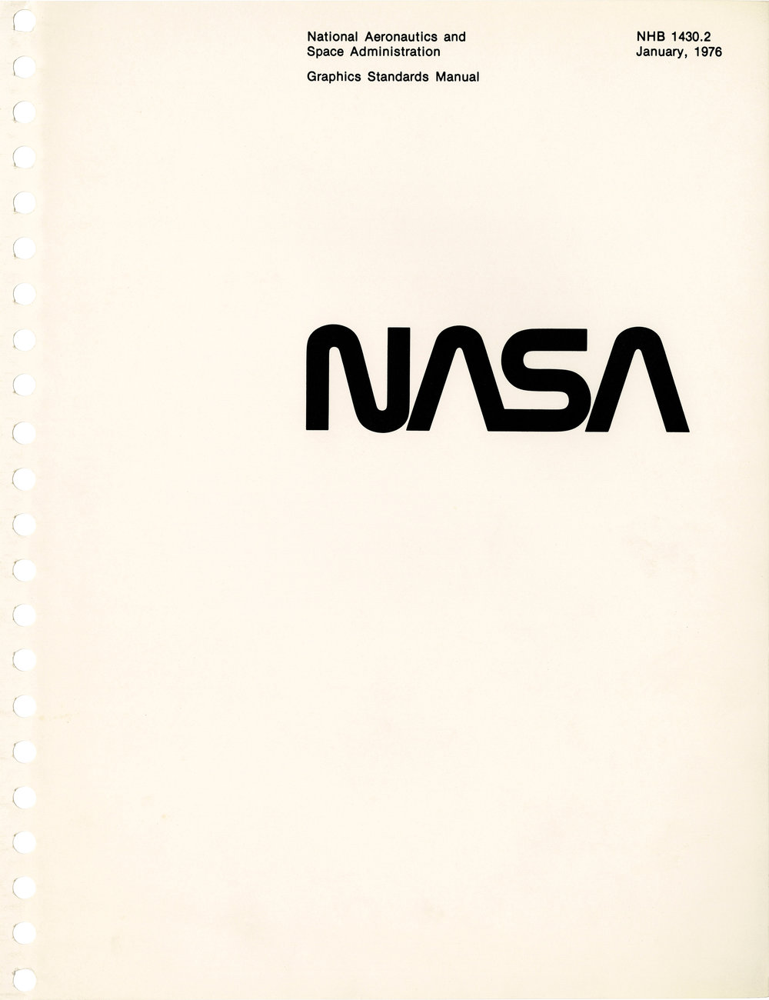

<!--

In graphic design

* Web & software
* Responsive and generative designs (Whitney, Tate)
* Grids - http://timbroadwater.com/2014/05/tschichold-dwiggins-muller-brockmann-and-the-grid/
* Corporate Identity & Visual systems (Meggs)
* Typography (Bringhurst e.o.) Scales, page layout

-->

# The Evolvement of visual design systems

## Design systems

From Designing Objects to Designing systems.
Systems that make better design results.
We make spaces.

**Google Material Design** | 2014

Material Design is a design language developed in 2014 by Google. It's goals are to create a visual language that synthesizes classic principles of good design with the innovation and possibility of technology and science.
[material.google.com](https://material.google.com)

---

**METRO - Microsoft Design Language** | 2006

Metro is the obsolete name of a typography- and geometry-focused design language created by Microsoft. The design language is based on the design principles of classic Swiss graphic design.

[Metro Concept book](http://www.istartedsomething.com/20100316/a-look-at-metro-the-book/)

[Microsoft Design Language principles](https://www.microsoft.com/en-us/design/principles)

**Apple Human Interface Guidelines**

---

**Atomic Design**

---

**Whitney museum - responsive** |

---

**Tate** |

---

**British Railways Corporate Identity Manual** | 1965

The original manuals spanned four volumes, all utilising a MULT-O 23-ring binder system. Issued in July 1965, binder one contained information on the core brand elements such as the symbol, logotype, lettering and colour palette. Binder two, issued in November 1966, contained guidance on printed publicity. In 1970, binders three and four were introduced containing guidance on architecture and signposting, rolling stock, lineside equipment, road vehicles, ships, liner trains, uniforms and stationery.

---

**NASA Graphics Standards Manual** | 1975

The NASA Graphics Standards Manual by Richard Danne and Bruce Blackburn is a futuristic vision for an agency at the cutting edge of science and exploration. – [standardsmanual.com](https://standardsmanual.com/products/nasa-graphics-standards-manual)

---

**Grid Systems - Joseph Müller Brockmann** | 1950?

Josef Müller-Brockmann (1914−1996) studied architecture, design and history of art in Zurich and worked as a graphic designer and teacher. His work is recognized for its simple designs and his clean use of fonts, shapes and colors, which still inspires many graphic designers throughout the world today. Since the 1950s grid systems help the designer to organize the graphic elements and have become a world wide standard. – [n'li](https://www.niggli.ch/en/grid-systems-in-graphic-design.html)

---

**Modulor - Le Corbusier** | 1948

Le Corbusier developed the Modulor in the long tradition of Vitruvius, Leonardo da Vinci's Vitruvian Man, the work of Leon Battista Alberti, and other attempts to discover mathematical proportions in the human body and then to use that knowledge to improve both the appearance and function of architecture.[1] The system is based on human measurements, the double unit, the Fibonacci numbers, and the golden ratio. Le Corbusier described it as a "range of harmonious measurements to suit the human scale, universally applicable to architecture and to mechanical things". – [Wikipedia](https://en.wikipedia.org/wiki/Modulor)

---

**The typographic scale** | 1500

In the sixteenth century, a series of common typographic sizes developed among European typographers, and the series survived with little change and few additions for 400 years. – Mr. Bringhust in The Elements of Typographic Style.
