<!--

In graphic design

* Web & software
* Responsive and generative designs, adaptable (Whitney, Tate), https://99designs.nl/blog/creative-inspiration/trend-spotting-adaptive-logo-design/
* Grids - http://timbroadwater.com/2014/05/tschichold-dwiggins-muller-brockmann-and-the-grid/
* Corporate Identity & Visual systems (Meggs)
* Typography (Bringhurst e.o.) Scales, page layout

-->

# a summary of visual design systems

## About Design systems

Unimark, an international design firm believed that design could be a system, a basic structure set up so that other people could implement it effectively.... Systems that make better design results.

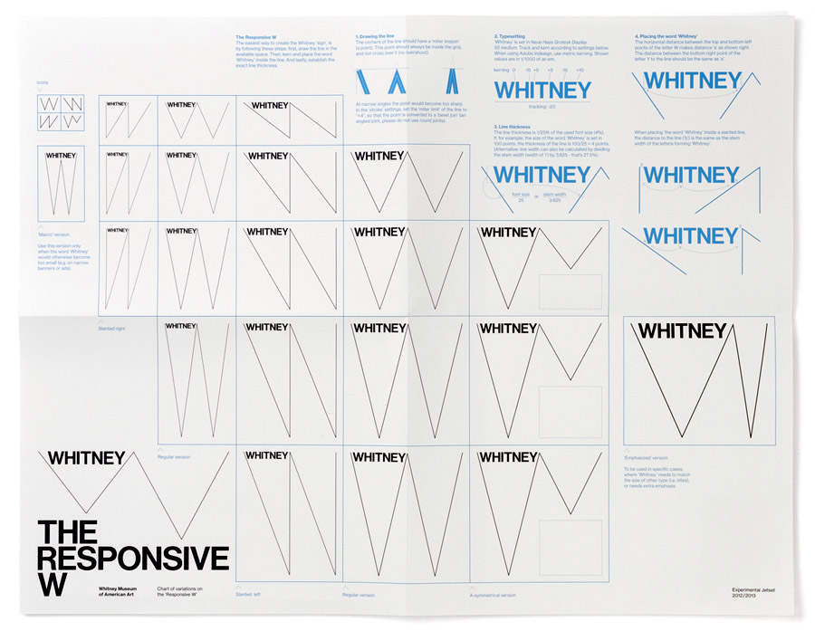

**Whitney Museum - The Responsive W** | 2015

The idea of the ‘responsive W’: the line as a graphic agent of systems (and of anti-systems), as a signifier of modern art, as a sketch of things-yet-to-come, as a diagrammatic device, and as a representation of lineage (and thus of heritage). The ‘Responsive W’ can also be seen as a flexible typographic grid. The W-shaped construction is an excellent platform for all kinds of text – in this case the name ‘Whitney’.
 [Experimental Jetset](http://www.experimentaljetset.nl/archive/whitney-museum-identity)

---

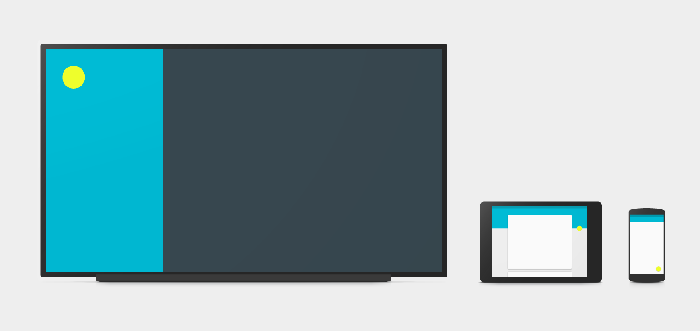

**Google Material Design** | 2014

Material Design is a design language developed in 2014 by Google. It's goals are to create a visual language that synthesizes classic principles of good design with the innovation and possibility of technology and science.
[material.google.com](https://material.google.com)

---

**METRO - Microsoft Design Language** | 2006

Metro is the obsolete name of a typography- and geometry-focused design language created by Microsoft. The design language is based on the design principles of classic Swiss graphic design.
 [Metro Concept book](http://www.istartedsomething.com/20100316/a-look-at-metro-the-book/) [Microsoft Design Language principles](https://www.microsoft.com/en-us/design/principles)

**Apple Human Interface Guidelines**

---

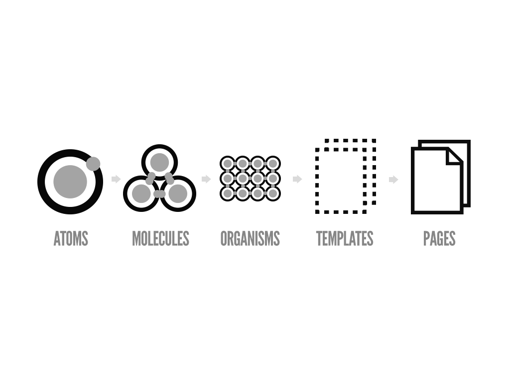

**Atomic Design** | 2013

Atomic design is a methodology composed of five distinct stages working together to create interface design systems in a more deliberate and hierarchical manner.
[Atomic Design](http://atomicdesign.bradfrost.com/)

---

**Tate** |

---

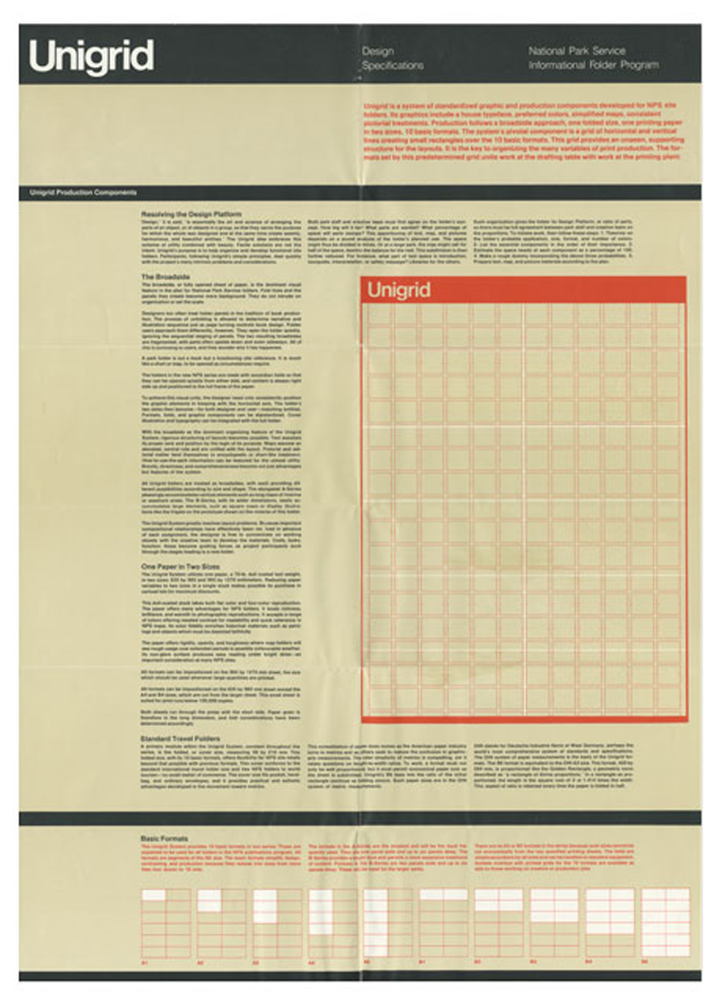

**Unigrid** | 1977

Unimark, an international design firm believed that design could be a system, a basic structure set up so that other people could implement it effectively. The basic tool for this effort was the grid. Helvetica wat the preferred typeface for all Unimark visual-identity systems. When the offices of Unimark closed during the recession of the 1970's Massimo Vignelli founded Vignelli Associates in 1971. The Unigrid system is developed in 1977 for the United States National Park Service by Vignelly Associates. It is based on simple basic elements. – Meggs

---

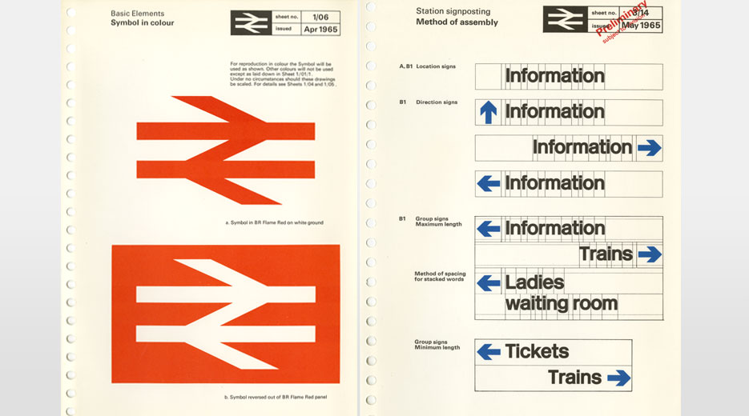

**British Railways Corporate Identity Manual** | 1965

The original manuals spanned four volumes, all utilising a MULT-O 23-ring binder system. Issued in July 1965, binder one contained information on the core brand elements such as the symbol, logotype, lettering and colour palette. Binder two, issued in November 1966, contained guidance on printed publicity. In 1970, binders three and four were introduced containing guidance on architecture and signposting, rolling stock, lineside equipment, road vehicles, ships, liner trains, uniforms and stationery. The identity design was created by Design Research Unit’s Gerry Barney initially in 1965

---

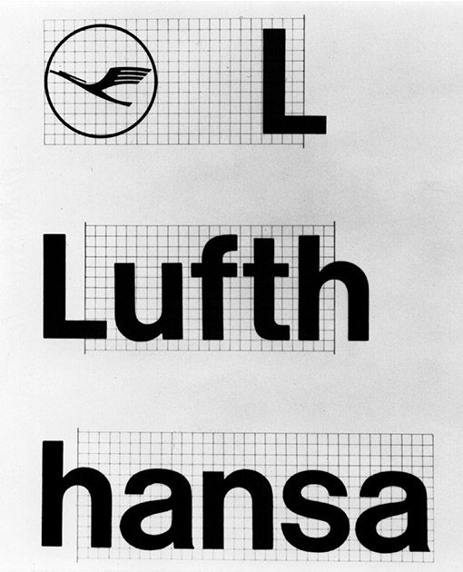

**Lufthansa German Airlines identification system** | 1962

During the 1960's the impetus of the International Typographic style and the visual-identity movement joined with the development of highly systematic design programs to combine complex and diverse paths into a unified whole. The 1962 Lufthansa German Airlines identification system was conceived and produced at the Ulm Institute of Design. The Lufthansa corporate-identity program became an international prototype for the closed identity system, with every detail and specification addressed for absolute uniformity. – Meggs.

---

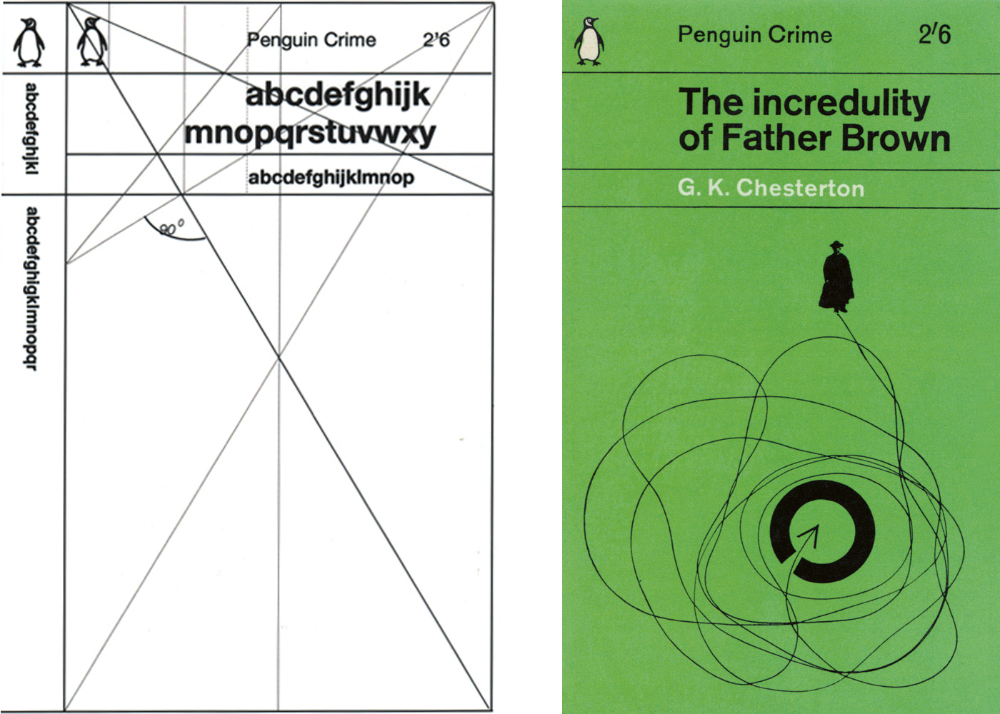

**Marber Grid** | 1961

Romek Marber’s 1960s paperback grid & identity is a landmark of independent British design. Marber was conscious of the Swiss Style, to which his typography is clearly indebted, but a visit to Switzerland, he says, ‘put me off Swiss design slightly’. He felt that the imposition of Swiss grids led to a lack of vitality. Marber’s grid allows for different placements of title and author’s name depending on the length of the title and the needs of the design as a whole.
http://www.eyemagazine.com/feature/article/penguin-crime-text-in-full
https://www.creativereview.co.uk/penguin-by-illustrators-romek-marber/

---

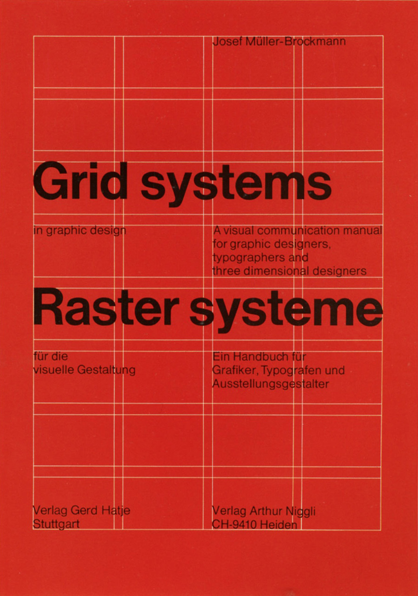

**Baseling Grid - Joseph Müller Brockmann** | 1950?

Josef Müller-Brockmann (1914−1996) studied architecture, design and history of art in Zurich and worked as a graphic designer and teacher. His work is recognized for its simple designs and his clean use of fonts, shapes and colors, which still inspires many graphic designers throughout the world today. Since the 1950s grid systems help the designer to organize the graphic elements and have become a world wide standard. – [n'li](https://www.niggli.ch/en/grid-systems-in-graphic-design.html)

---

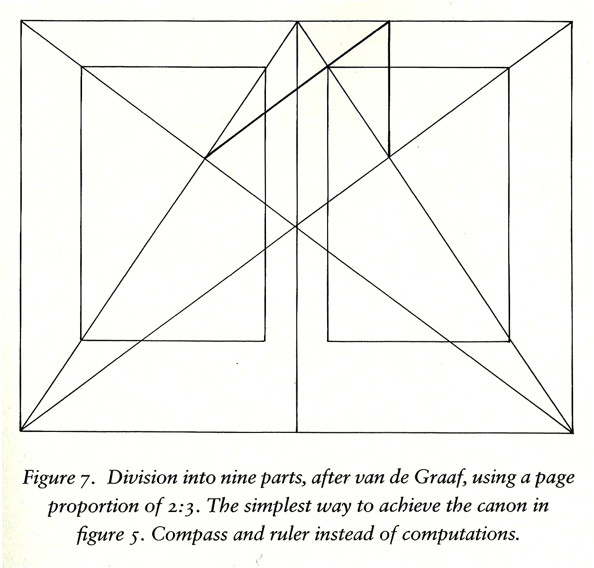

**The Canons of page construction** | 1950

The canons of page construction are a set of principles in the field of book design used to describe the ways that page proportions, margins and type areas (print spaces) of books are constructed. The notion of canons, or laws of form, of book page construction was popularized by Jan Tschichold in the mid to late twentieth century, based on the work of J. A. van de Graaf, Raúl M. Rosarivo, Hans Kayser, and others. Tschichold wrote, “Though largely forgotten today, methods and rules upon which it is impossible to improve have been developed for centuries. To produce perfect books these rules have to be brought to life and applied.”
[Wikipedia](https://en.wikipedia.org/wiki/Canons_of_page_construction#cite_note-tschichold-1)
[The form of the book](https://www.amazon.com/Form-Book-Morality-Classic-Typography/dp/0881791164)

---

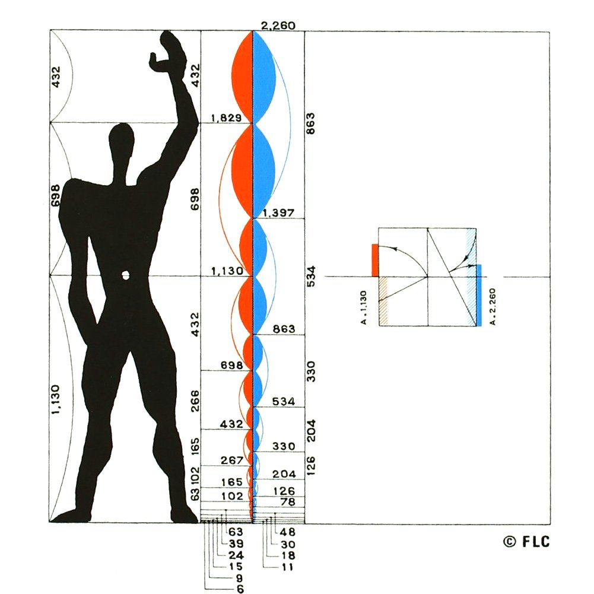

**Modulor - Le Corbusier** | 1948

Le Corbusier developed the Modulor in the long tradition of Vitruvius, Leonardo da Vinci's Vitruvian Man, the work of Leon Battista Alberti, and other attempts to discover mathematical proportions in the human body and then to use that knowledge to improve both the appearance and function of architecture.[1] The system is based on human measurements, the double unit, the Fibonacci numbers, and the golden ratio. Le Corbusier described it as a "range of harmonious measurements to suit the human scale, universally applicable to architecture and to mechanical things". – [Wikipedia](https://en.wikipedia.org/wiki/Modulor)

---
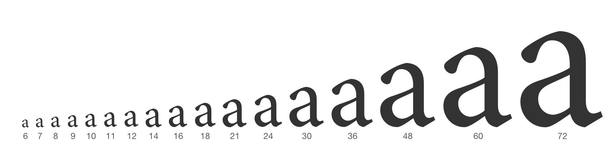

**The typographic scale** | 1500

In the sixteenth century, a series of common typographic sizes developed among European typographers, and the series survived with little change and few additions for 400 years. – Mr. Bringhust in The Elements of Typographic Style.

---

*Scan image from p. 12 - Thinking with type.*

**Movable type** | 1456

Movable type, invented by Johannes Gutenberg in Germany in the early fifteenth century, revolutionized writing in the west. Printing with type allowed mass production: large quantities of letters could be cast from a mold and assembled into “forms”. Movable type had been employed in China but had proven less useful there. – Thinking with type

---

## Books

* [Lufthansa und Graphic Design](https://www.lars-mueller-publishers.com/a505-lufthansa-und-graphic-design)
* [UNIMARK](https://www.lars-mueller-publishers.com/unimark-international)
* [Meggs history of graphic design](http://eu.wiley.com/WileyCDA/WileyTitle/productCd-1118772059.html)
* [The Elements of typographic Style](https://www.amazon.co.uk/Elements-Typographic-Style-Robert-Bringhurst/dp/0881792063)

## Online
