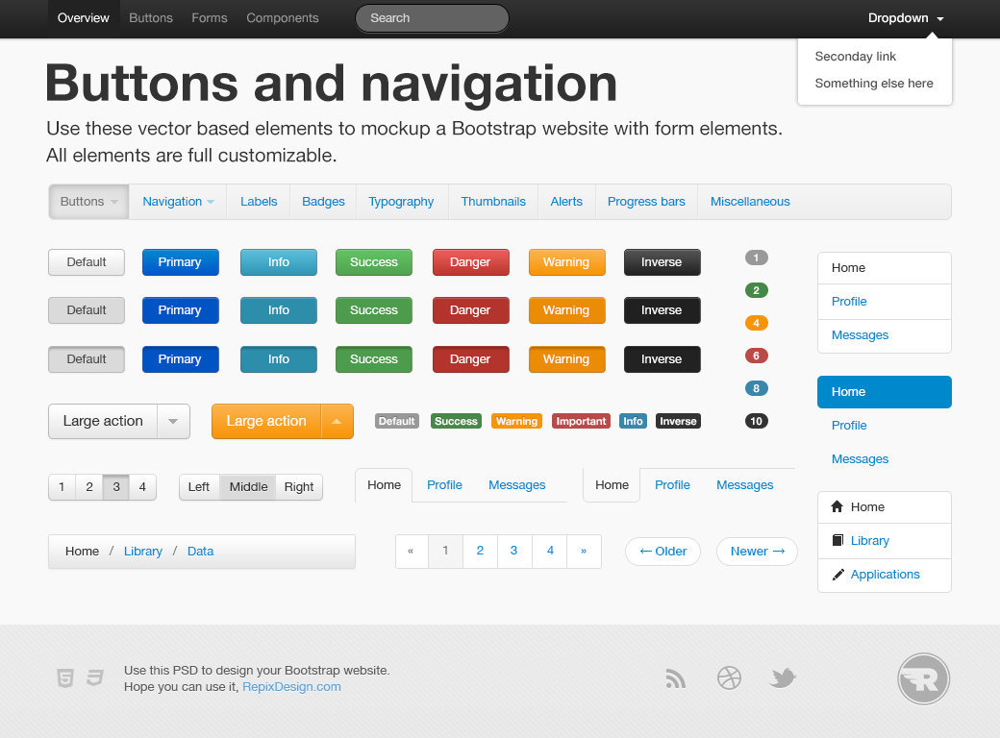
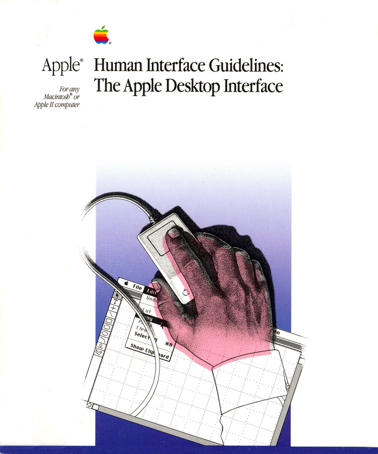

# a summary of visual design systems

## About
The purpose of the list below is to provide an overview of visual design systems that have had a significant impact. It is a work in progress. Is there a system that should be listed here? Please [let me know](/about).

## A short history
In the study of visual design systems, it becomes apparent that the creation and application of systems have been part of graphic design and typography from the earliest days. Engineering, science, philosophy and entrepreneurship go hand-in-hand with design, witness the invention of movable type.

An example of the scientific approach is found in the development of a new typeface for the Imprimerie Royale in 1692. The new letter was to be designed by "scientific" principles. Headed by mathematician Nicolas Jaugeon, the academicians examined all previous alphabets and studies on type design. To construct the new roman capital letters, a square was divided into a grid of sixty-four units; each of these units was divided further into thirty-six smaller units for a total of 2.304 tiny squares. A mathematical harmony was achieved by measurement and drafting instruments.
<small>
Philip B. Meggs and Alston W. Purvis. Meggs' History of Graphic Design. Wiley. 6th Edition. p. 129.
</small>

Much later, Unimark, an international design firm in the 60's believed that design could be a (rational) system, a basic structure set up so that other people could implement it effectively. Helvetica and brand identity systems are probably the most popular outcome of this period.

Today a new exciting mix of the 'classic' principles behind visual design systems of the past and the new digital landscape appears, as is shown by Google's Material Design system:

> "We challenged ourselves to create a visual language for our users that synthesizes the classic principles of good design with the innovation and possibility of technology and science."
<small>
Google. Material design. [material.google.com](https://material.google.com)
</small>

Rune Skjoldborg Madsen promotes graphic designers to code. In his online book *Programming Design Systems* he sums up how designers could benefit from learning to code.

> "Digital products *are* systems, and designers who code are no longer confined to the creation of design systems that end up in printed manuals. Code allows designers to not just create designs, but build digital systems that create designs. Granted, more time will be spent on formulating the rules of the system in code, but designers will be free from the limitations imposed by traditional design software."
<small>
Programming Design Systems. [programmingdesignsystems.com](http://programmingdesignsystems.com)
</small>

Especially the internet opens up new opportunities for a much broader audience, of which self-publishing is a prominent one. Instead of design systems for designers, we're moving to design systems for end-users. Systems that make better design results possible, for anyone.

## visual design systems

**Google Material Design** 2014

Material Design is a design language developed in 2014 by Google. It's goals are to create a visual language that synthesizes classic principles of good design with the innovation and possibility of technology and science.
 
<small>
Google. Material design. [material.google.com](https://material.google.com)
</small>

---

**Atomic Design** 2013

Atomic design is a methodology composed of five distinct stages working together to create interface design systems in a more deliberate and hierarchical manner.
 
<small>
Brad Frost. Atomic Design. [atomicdesign.bradfrost.com](http://atomicdesign.bradfrost.com/)
</small>

---

**Bootstrap** 2011

Originally created by a designer and a developer at Twitter, Bootstrap has become one of the most popular front-end frameworks and open source projects in the world. Bootstrap was created at Twitter in mid-2010 by @mdo and @fat. Prior to being an open-sourced framework, Bootstrap was known as Twitter Blueprint. A few months into development, Twitter held its first Hack Week and the project exploded as developers of all skill levels jumped in without any external guidance. It served as the style guide for internal tools development at the company for over a year before its public release, and continues to do so today.
 
<small>
Bootstrap
[getbootstrap.com/about/](http://getbootstrap.com/about/)
</small>

---

**METRO** 2006

Metro is the obsolete name of a typography- and geometry-focused design language created by Microsoft. The design language is based on the design principles of classic Swiss graphic design.
 
<small>
Metro Concept Book. Microsoft. [www.istartedsomething.com/20100316/a-look-at-metro-the-book](http://www.istartedsomething.com/20100316/a-look-at-metro-the-book/)
</small>

---

**Apple Human Interface Guidelines**  1978

Tog was an early and influential employee of Apple Computer, there from 1978 to 1992.
His extensive work in user-interface testing and design, including publishing the first edition, in September, 1978, and seven subsequent editions of The Apple Human Interface Guidelines, played an important role in the direction of Apple's product line from the early days of Apple into the 1990s.
 
<small>
Wikipedia. Bruce Tognazzini [https://en.wikipedia.org/wiki/Bruce_Tognazzini](en.wikipedia.org/wiki/Bruce_Tognazzini)
</small>

---

**Unigrid** 1977

Unimark, an international design firm believed that design could be a system, a basic structure set up so that other people could implement it effectively. The basic tool for this effort was the grid. Helvetica was the preferred typeface for all Unimark visual-identity systems. When the offices of Unimark closed during the recession of the 1970's Massimo Vignelli founded Vignelli Associates in 1971. The Unigrid system is developed in 1977 for the United States National Park Service by Vignelly Associates. It is based on simple basic elements.
 
<small>
Philip B. Meggs and Alston W. Purvis. Meggs' History of Graphic Design. Wiley. 6th Edition.
</small>

---

**British Railways Corporate Identity Manual** 1965

The original manuals spanned four volumes, all utilising a MULT-O 23-ring binder system. Issued in July 1965, binder one contained information on the core brand elements such as the symbol, logotype, lettering and colour palette. Binder two, issued in November 1966, contained guidance on printed publicity. In 1970, binders three and four were introduced containing guidance on architecture and signposting, rolling stock, lineside equipment, road vehicles, ships, liner trains, uniforms and stationery. The identity design was created by Design Research Unit’s Gerry Barney initially in 1965.
 
<small>
Kickstarter. British Rail Corporate Identity Manual.  [www.kickstarter.com/projects/1863728218/british-rail-corporate-identity-manual](https://www.kickstarter.com/projects/1863728218/british-rail-corporate-identity-manual)
</small>

---

**Lufthansa German Airlines identification system** 1962

During the 1960's the impetus of the International Typographic style and the visual-identity movement joined with the development of highly systematic design programs to combine complex and diverse paths into a unified whole. The 1962 Lufthansa German Airlines identification system was conceived and produced at the Ulm Institute of Design. The Lufthansa corporate-identity program became an international prototype for the closed identity system, with every detail and specification addressed for absolute uniformity.
 
<small>
Philip B. Meggs and Alston W. Purvis. Meggs' History of Graphic Design. Wiley. 6th Edition.
</small>

---

**Marber Grid** 1961

Romek Marber’s 1960s paperback grid & identity is a landmark of independent British design. Marber was conscious of the Swiss Style, to which his typography is clearly indebted, but a visit to Switzerland, he says, ‘put me off Swiss design slightly’. He felt that the imposition of Swiss grids led to a lack of vitality. Marber’s grid allows for different placements of title and author’s name depending on the length of the title and the needs of the design as a whole.
 
<small>
Eye Magazine. Penguin Crime Text In Full. [www.eyemagazine.com/feature/article/penguin-crime-text-in-full](http://www.eyemagazine.com/feature/article/penguin-crime-text-in-full)
</small>

---

**Baseling Grid** 1950

Josef Müller-Brockmann (1914−1996) studied architecture, design and history of art in Zurich and worked as a graphic designer and teacher. His work is recognized for its simple designs and his clean use of fonts, shapes and colors, which still inspires many graphic designers throughout the world today. Since the 1950s grid systems help the designer to organize the graphic elements and have become a world wide standard.
 
<small>
Joseph Müller Brockmann. Grid systems in graphic design. n'li. 8th revised edition.
</small>

---

**The Canons of page construction** 1950

The canons of page construction are a set of principles in the field of book design used to describe the ways that page proportions, margins and type areas (print spaces) of books are constructed. The notion of canons, or laws of form, of book page construction, was popularized by Jan Tschichold in the mid to late twentieth century, based on the work of J. A. van de Graaf, Raúl M. Rosarivo, Hans Kayser, and others. Tschichold wrote, “Though largely forgotten today, methods and rules upon which it is impossible to improve have been developed for centuries. To produce perfect books these rules have to be brought to life and applied.”
 
<small>
Wikipedia. Canons of page construction. [en.wikipedia.org/wiki/Canons_of_page_construction](https://en.wikipedia.org/wiki/Canons_of_page_construction)
</small>

---

**Modulor - Le Corbusier** 1948

Le Corbusier developed the Modulor in the long tradition of Vitruvius, Leonardo da Vinci's Vitruvian Man, the work of Leon Battista Alberti, and other attempts to discover mathematical proportions in the human body and then to use that knowledge to improve both the appearance and function of architecture.[1] The system is based on human measurements, the double unit, the Fibonacci numbers, and the golden ratio. Le Corbusier described it as a "range of harmonious measurements to suit the human scale, universally applicable to architecture and to mechanical things".
 
<small>
Wikipedia. Modulor. [en.wikipedia.org/wiki/Modulor](https://en.wikipedia.org/wiki/Modulor)
</small>
---

**The typographic scale** 1500

In the sixteenth century, a series of common typographic sizes developed among European typographers, and the series survived with little change and few additions for 400 years.
 
<small>
Robert Bringhurst. The Elements of Typographic Style. 4th edition. Hartley and Marks Publishers. 2013.
</small>

---

*Scan image from p. 12 - Thinking with type.*

**Movable type** 1456

Movable type, invented by Johannes Gutenberg in Germany in the early fifteenth century, revolutionized writing in the west. Printing with type allowed mass production: large quantities of letters could be cast from a mold and assembled into “forms”. Movable type had been employed in China but had proven less useful there.
 
<small>
Ellen Lupton. Thinking with type. Princeton Architectural Press; 2 Rev Exp edition. 2010.
</small>

---

Follow updates on my twitter account [twitter.com/rienswagerman](https://twitter.com/rienswagerman)

---
