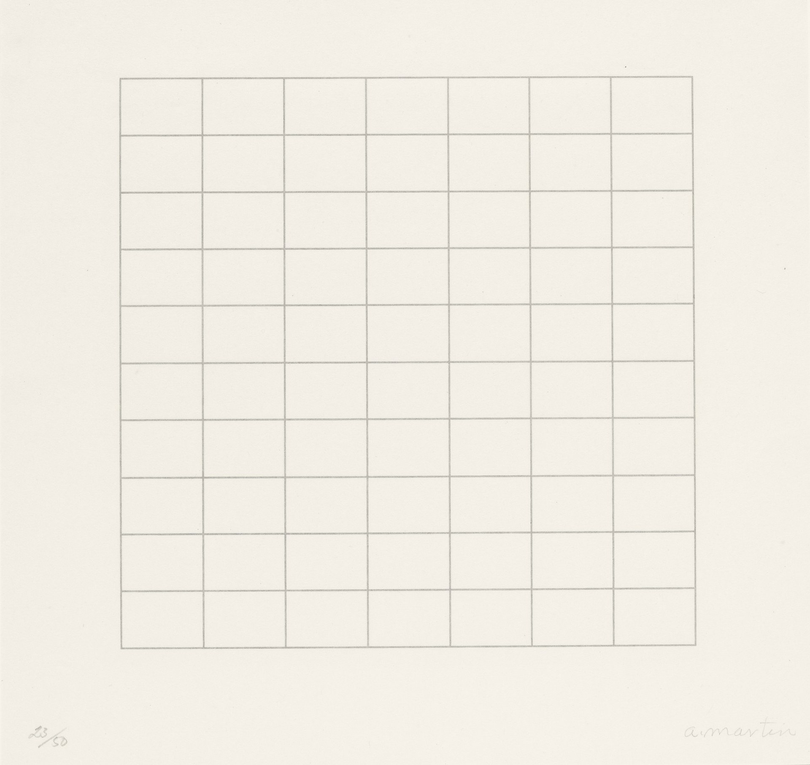
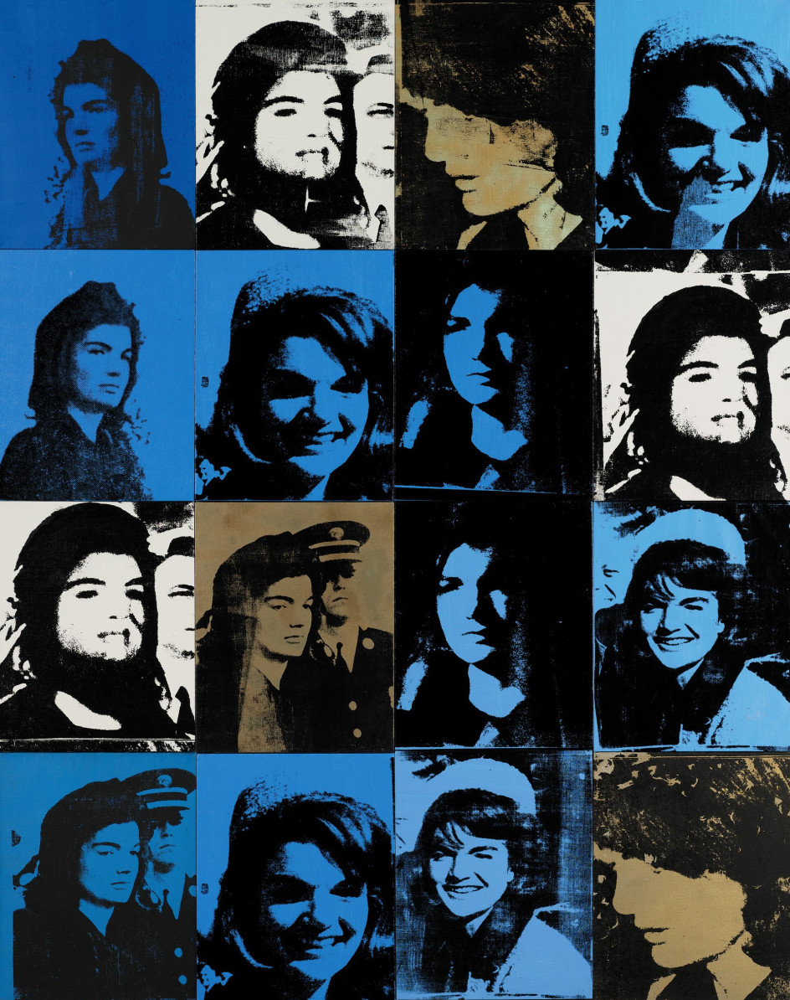
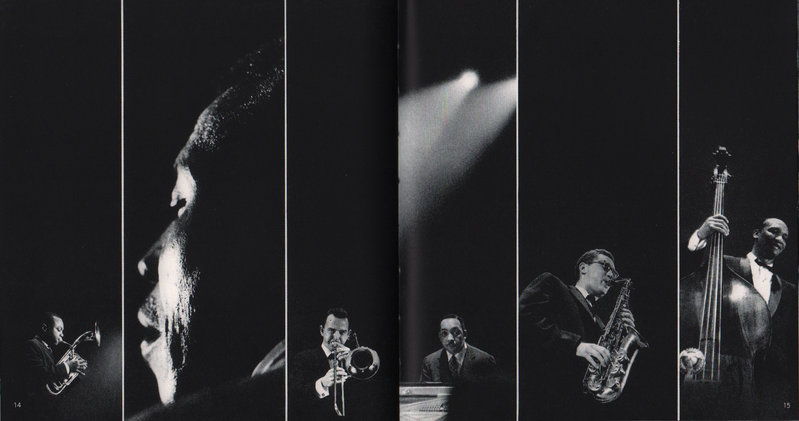
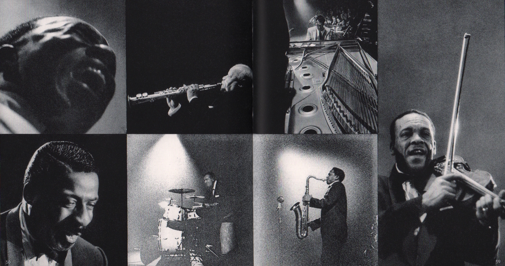
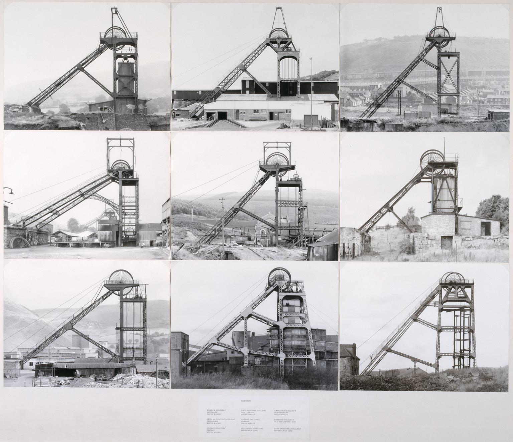
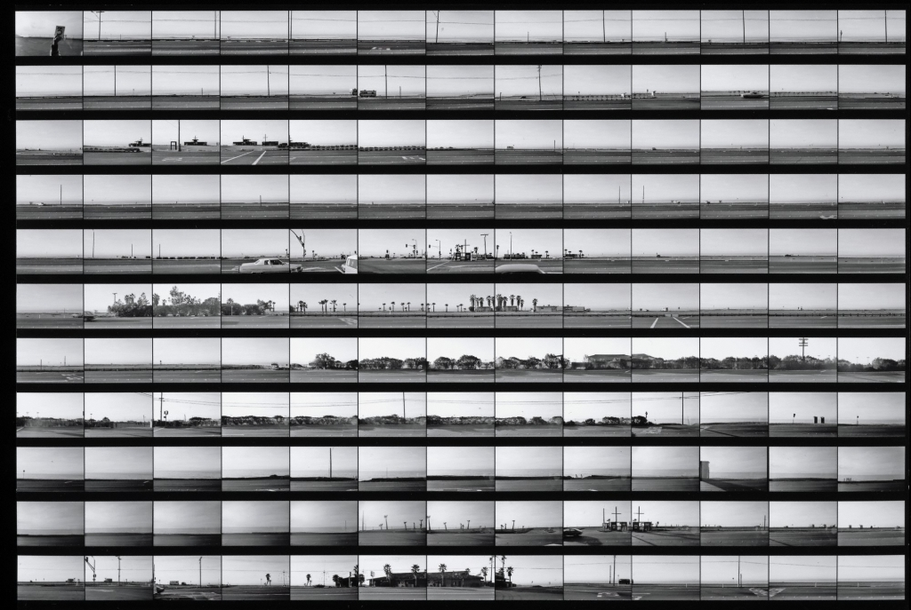
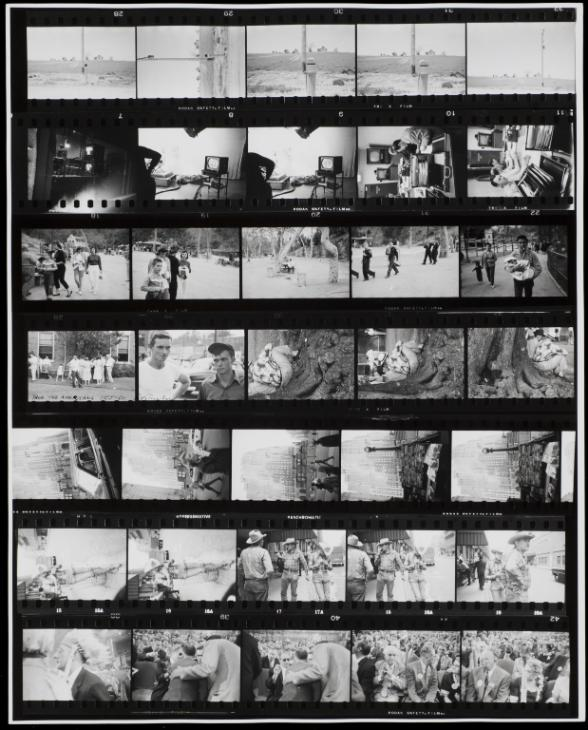

# photographic grids

In 1967 Agnes Martin stopped painting. She bought an Airstream trailer and went back to the protection of the New Mexico desert. On a clear day, five years later, Agnes traveled to Germany at the invitation of a German art printer to create a set of silk screens. They constitute the grammar of linear divisions (grids) that she would employ for the rest of her life 1.

Agnes Martin, one of my favorite artists, shows us one of the purest manifestations of the grid. Martin mathematically worked out on paper the line intervals in any given series of pictures before she began painting; sheets filled with complex calculations. While this is sounding technical, it was to create the purest, abstract paintings that express innocence of mind.

 <small> ‘The imperfections in Martin’s hand-drawn lines allow her paintings to breathe’ ... On a Clear Day, 1973, by Agnes Martin. Photograph: Agnes Martin / Artists Rights Society (ARS) From [The Guardian](Off the grid: the quiet, controlled paintings of Agnes Martin).</small>

She writes "our response to line and tone and color is the same as our response to sound." A common analogy; one of the simplest of all systems of proportions in book design is based on the intervals of the diatonic musical scale. Pages that embody these basic musical proportions have been common in Europe for more than thousand years 2. 

## Coming to order

The history of the grid's development is complex. The occurrence of grid use predates the Romans and the Greeks. The grid used in western graphic design evolved during the Industrial Revolution with as highlight the International Style. In it's reaction to industrial standardization, the Pop Art movement placed the grid front and center. Artists like Andy Warhol, Roy Lichtenstein, raised the language of mechanical reproduction to the level of high art. 

 <small>Andy Warhol, 16 Jackies (1964) © The Andy Warhol Foundation for the Visual Arts, Inc./Artists Rights Society (ARS), New York.</small>

## photographic grids

When placing photos in a grid layout, any image is in a relationship with the other, forming new meanings. I will look at how this works and how grid layouts make photo narratives, typologies, collections, and sequences. 

A striking example is Ed van der Elsken's photobook *Jazz*. Pages are split into two-, three-, four-, and six-part image combinations, resembling the clusters of notes in a saxophone or trumpet run. Graphically, vertical clusters of images suggest piano keys, while horizontal, stretched images recall held notes. The result is a book that visually echoes the music itself3. We can characterize this as a *photo narrative*.

<small>Image from [Tate Modern website](http://www.tate.org.uk/context-comment/articles/long-look-bernd-hilla-becher)</small>

A uniform way of presenting photography in a grid make a *typology*. Bernd and Hilla Becher have spent their life together photographing the unintended beauty that can be found in industrial structures. By placing photographs of similar subjects alongside each other, the individual differences emerge, making the fine details in each picture more noticeable, more distinct4. The beauty depicted in these structures is undeniable, especially when grouped together for comparison; in the grid, your eye hones in on the subtle differences from structure to structure--a reminder that they all sprung from a conscious (and creative) human design5. 

<small>Ed Ruscha. ‘Contact sheet – Pacific Coast Highway,’ 1974-1975. | Photo: The Getty Research Institute, Los Angeles (2012.M.2)</small>

This contact sheet of Ed Ruscha's *Pacific Coast Highway* project displays a *sequence* of images made by mounting a 35 mm camera to a slow-moving automobile6.

 <small>Image from [Tate Modern](http://www.tate.org.uk/art/artworks/frank-contact-sheet-from-the-americans-p79744) website</small>

The grid layout of the contact sheet makes it possible to compare and select. It gives a structured overview of time and sequence. When looking at them later, they reveal the creative methods, strategies and editing processes7. The contact sheet has become an object of the past, but it is also an artifact in itself. It symbolizes an independent genre related to film, storytelling, and tradition in photojournalism8. The 'Thumbnail' can be seen as a digital cognate of the contact print9.

*More coming soon.*

---
<small>

  * 1, 2 Arne Glimcher. Agnes Martin, Paintings, Writings, Remembrances. Phaidon.
  * 2 Robert Bringhurst. The Elements of Typographic Style. H&M Publishers.
  * 3 Martin Parr and Gerry Badger. The Photobook - A History Volume 1. Phaidon.
  * 4 Tate.  http://www.tate.org.uk/context-comment/articles/long-look-bernd-hilla-becher
  * 5 americanphotomag.com http://www.americanphotomag.com/instant-expert-bernd-and-hilla-becher
  * 6 http://www.getty.edu/art/exhibitions/focus_ruscha/
  * 7 https://www.magnumphotos.com/theory-and-practice/magnum-contact-sheets/
  * 8 https://www.foam.org/about/press-office/magnum-contact-sheets
  * 9 https://en.wikipedia.org/wiki/Thumbnail

</small>